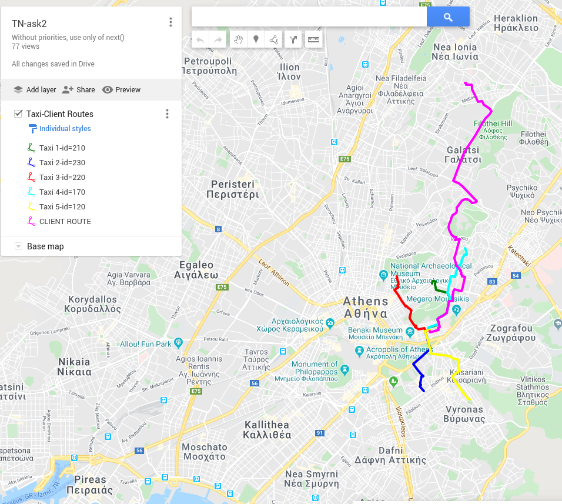

# Project for the academic course "Artificial Intelligence" (ECE NTUA )

## Description

Part1: Implementation of the **A\* search algorithm** using *Java* for taxi's navigation on a map(calculation of the fastest route from taxi's current position to client's location). The data are collected from OpenStreetMaps. 
  
Part2: In addition to Java, *Prolog* is also used via **JIProlog** in order to read useful information about the world, such as traffic, roads with tolls, highway road, max speed etc. ,  which is stored in its knowledge base.



## Usage
```
$ java Main clients.csv taxis.csv lines.csv nodes.csv traffic.csv
```
## Students

The project was implemented by 

* Dimitrios Kalogeropoulos
* Iasonas Chardouvelis
